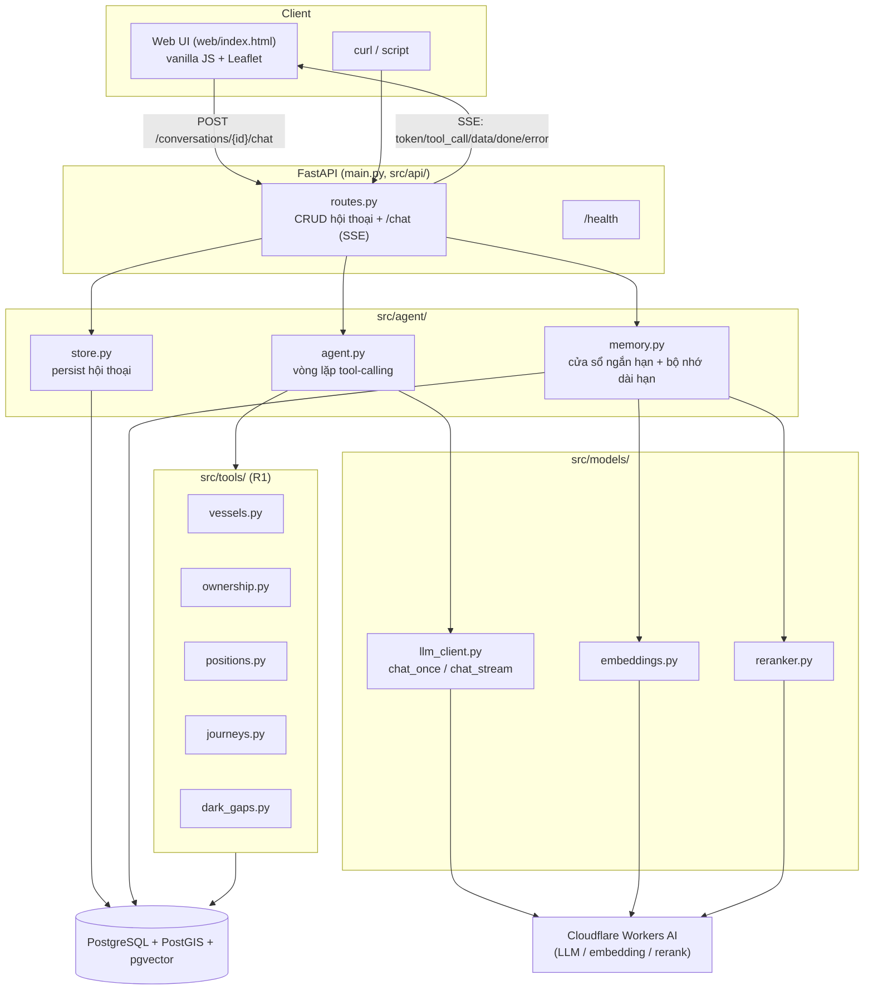
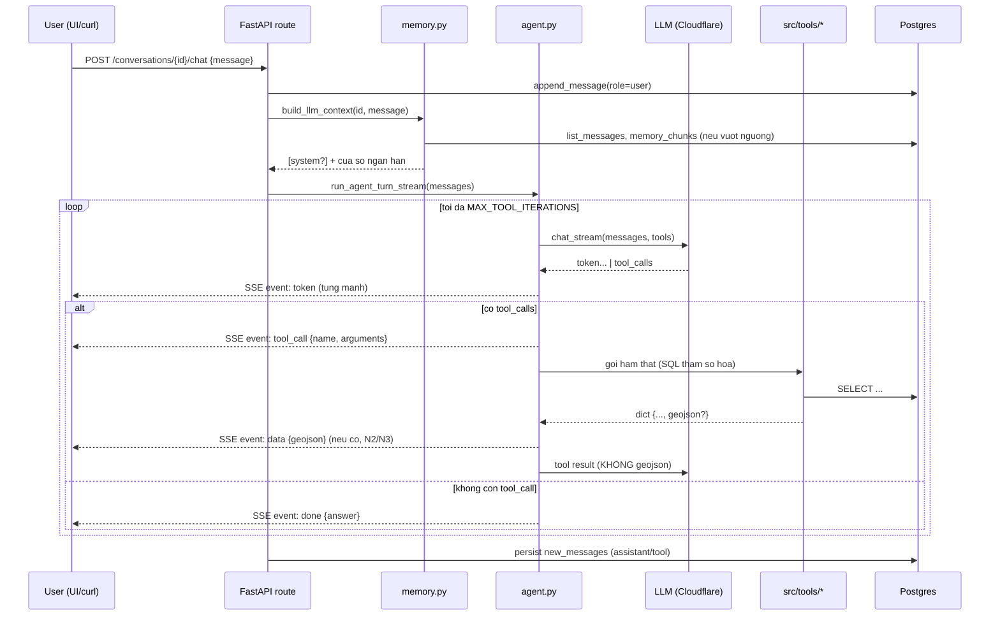

# Kiến trúc hệ thống

## 1. Sơ đồ thành phần

**Không dùng framework agent (LangChain/LangGraph)** — vòng lặp tool-calling
tự viết (~100 dòng, `src/agent/agent.py`) để giải thích được từng bước.

## 2. Luồng xử lý 1 câu hỏi

Điểm quan trọng: **dữ liệu bản đồ (geojson) tách khỏi nội dung gửi LLM**
(`agent.py::_split_geojson`) — LLM chỉ thấy phần tóm tắt (số tàu, số điểm,
bbox), toạ độ chi tiết đi thẳng tới UI qua sự kiện `data`, đúng yêu cầu N2/N3
"dữ liệu lớn không đi qua model".

## 3. Thiết kế bộ nhớ (R3)

`src/agent/memory.py::build_llm_context()`:

1. **Cửa sổ ngắn hạn**: nếu tổng số message ≤ `CONTEXT_WINDOW_TURNS` (đếm
   theo message, không phải "lượt"), dùng nguyên văn toàn bộ lịch sử.
2. **Vượt ngưỡng**: message cũ hơn cửa sổ được **tóm tắt gia tăng** (chỉ
   phần mới rơi ra khỏi cửa sổ mỗi lần, không tóm tắt lại từ đầu) bằng LLM
   → nhúng vector (`bge-m3`, đa ngôn ngữ, tóm tắt viết bằng **tiếng Anh** dù
   hội thoại gốc tiếng Việt — embedding/rerank phân biệt tốt hơn với tiếng
   Anh, không ảnh hưởng câu trả lời cuối vì đó luôn bằng tiếng Việt) → lưu
   `memory_chunks`.
3. **Truy xuất khi trả lời**: nhúng câu hỏi hiện tại → lấy top-20 ứng viên
   theo cosine similarity (pgvector `<=>`) → **rerank** bằng cross-encoder
   (`bge-reranker-base`) → lấy top-3 → chèn thành 1 message `system` đặt
   TRƯỚC cửa sổ ngắn hạn, có câu dẫn nhấn mạnh đây là thông tin người dùng
   yêu cầu ghi nhớ (giảm thiên vị model ưu tiên ngữ cảnh gần đây).
4. Cắt cửa sổ **an toàn**: không bao giờ cắt giữa cặp
   `assistant(tool_calls)`/`tool`-result.

**So sánh 4 chiến lược bộ nhớ đã cân nhắc** (chi tiết lý do chọn: xem
`docs/research.md`):

| Chiến lược | Ưu | Nhược | Dùng ở đâu |
|---|---|---|---|
| Cửa sổ trượt (sliding window) | Đơn giản, không mất chi tiết gần đây | Mất hoàn toàn thông tin cũ | Luôn dùng cho N message gần nhất |
| Tóm tắt (summarization) | Nén được lượng lớn hội thoại | Có thể mất chi tiết khi model tóm tắt kém | Cho message rơi khỏi cửa sổ |
| Truy xuất vector (embedding retrieval) | Lấy đúng phần liên quan theo ngữ nghĩa, không phụ thuộc thứ tự thời gian | Độ chính xác phụ thuộc chất lượng embedding, kém khi nhiều chunk ngắn/giống nhau | Truy xuất từ `memory_chunks` |
| Kết hợp (đã chọn) | Bù trừ nhược điểm của từng cái | Phức tạp hơn, nhiều điểm có thể lỗi (đã gặp thật — xem mục 6) | Toàn bộ pipeline R3 |

## 4. Schema database

Xem đầy đủ tại [`db/schema.sql`](../db/schema.sql). Tóm tắt quyết định thiết kế:

- **Staging pattern**: COPY CSV vào bảng staging (toàn cột `text`) trước,
  ép kiểu/làm sạch khi `INSERT...SELECT` sang bảng chính — cách ly lỗi kiểu
  dữ liệu do CSV nhiễu (ô rỗng, số dạng `"9605047.0"`).
- **Generated columns** cho hình học (`geom`, `start_geom`, `end_geom`,
  `gap_line`) — tự tính từ lon/lat khi insert, không cần code riêng.
- **Index**: GiST cho cột hình học, B-tree cho `(vessel_id, event_ts)`, GIN
  trigram cho `shipname`/`company_name` (fuzzy search).
- Bảng ứng dụng (`conversations`, `messages`, `memory_chunks`) tách biệt
  hoàn toàn khỏi dữ liệu tàu biển (R1), có FK `ON DELETE CASCADE`.
- Idempotent: pipeline luôn `TRUNCATE` bảng đích trước khi nạp lại.

## 5. Danh sách tool

| Tool | Input chính | Đáp ứng |
|---|---|---|
| `search_vessel` | tên/MMSI/IMO | Tìm tàu linh hoạt, fuzzy (R1) |
| `get_vessel_info` | vessel_id | Thông tin tĩnh + ownership đầy đủ |
| `get_company_vessels` | tên công ty, role? | Tàu theo công ty, tự tìm biến thể tên |
| `list_vessels_by_type` | từ khoá loại tàu (EN) | Lọc theo loại tàu (N3) |
| `get_position_at_time` | vessel_id, thời điểm | Vị trí gần nhất + độ lệch thời gian |
| `get_journey` | vessel_id, khoảng thời gian | 1 hành trình, kèm GeoJSON |
| `get_multi_journey_geojson` | list vessel_id, khoảng thời gian | Nhiều hành trình (N3), giới hạn 50 tàu/lần, đơn giản hoá đường bằng `ST_Simplify` |
| `get_dark_gaps` | vessel_id?, order_by | Sự kiện mất tín hiệu AIS, kèm GeoJSON |

Nguyên tắc chung: SQL tham số hoá, chỉ SELECT có LIMIT, không dữ liệu thì
trả `None`/`[]` (R4). Tool nào trả `geojson` sẽ tự động được tách sang sự
kiện `data` (N2/N3), không cần khai báo gì thêm ở tầng agent.

## 6. API

| Endpoint | Việc |
|---|---|
| `GET /health` | Health check (kiểm tra kết nối DB) |
| `POST /conversations` | Tạo hội thoại |
| `GET /conversations?limit&offset` | Liệt kê (có phân trang) |
| `GET /conversations/{id}/messages` | Toàn bộ tin nhắn |
| `DELETE /conversations/{id}` | Xoá hội thoại |
| `POST /conversations/{id}/chat` | Streaming SSE: `token`, `tool_call`, `data`, `done`, `error` |

Chi tiết request/response: xem [`docs/api.md`](api.md) hoặc OpenAPI tự sinh
tại `/docs` khi chạy server.

## 7. Hạn chế đã biết

Ghi trung thực để không đánh giá quá cao mức độ hoàn thiện:

- **Không có auth/rate limiting** — bất kỳ ai cũng gọi được mọi
  `conversation_id`. Chấp nhận được cho bài test, KHÔNG chấp nhận được cho
  production thật.
- **Không có connection pool** — mỗi lời gọi tool mở/đóng 1 connection
  Postgres riêng. Ở quy mô bài test không vấn đề gì; tải cao cần
  `psycopg2.pool` hoặc PgBouncer.
- **R3 (bộ nhớ dài hạn) KHÔNG đạt độ tin cậy 100%, đây là điểm yếu lớn
  nhất của hệ thống — ghi nhận trung thực bằng dữ liệu thật, không tô
  hồng.** Quá trình phát triển đã tìm và sửa 3 bug thật: (1) bản tóm tắt bỏ
  mất thông tin cần nhớ dù văn bản gốc có đủ (sửa bằng prompt siết chặt),
  (2) ngưỡng similarity 0.5 loại bỏ cả chunk đúng nhất — điểm cosine của
  `bge-m3` trên tóm tắt ngắn rất hẹp (0.24–0.35), (3) embedding một mình
  không đủ phân biệt khi có 11+ chunk cạnh tranh — đã thêm rerank
  (cross-encoder) để bù. Sau cả 3 fix: 1 lần chạy độc lập đạt 2/2, nhưng
  1 lần chạy đầy đủ khác (cùng lúc với 4 kịch bản còn lại,
  `results/scenario_3.md`) lại quay về 0/2 — model nhầm sang tàu vừa nhắc
  gần nhất thay vì tàu đã yêu cầu ghi nhớ ở lượt 1. Kết luận: 3 fix đúng và
  cần thiết (xác nhận qua unit test + ít nhất 1 lần verify thành công),
  nhưng độ tin cậy tổng thể vẫn phụ thuộc vào tính không xác định của LLM
  20B tham số — cần retrieval tinh vi hơn (hybrid keyword+vector, hoặc lưu
  "fact" tường minh riêng cho yêu cầu "ghi nhớ" thay vì gộp chung vào tóm
  tắt ngữ nghĩa) hoặc model lớn hơn để đạt độ tin cậy production thật.
- **`get_multi_journey_geojson` giới hạn cứng 50 tàu/lần** — với truy vấn
  kiểu "toàn bộ tàu cargo" (628 tàu trong data), chỉ 50 tàu đầu tiên được
  vẽ. Đây là giới hạn thiết kế có chủ đích (tránh payload khổng lồ), nhưng
  chưa có cơ chế phân trang thật (trả trang tiếp theo) — chỉ cắt bớt.
- **So sánh chỉ tiêu (vd. "tàu nào xa nhất") trên nhiều tàu không scale** —
  phát hiện thật khi chạy Kịch bản 5: với câu hỏi "trong số 33 tàu, tàu nào
  đi xa nhất", model gọi `get_journey` TỪNG TÀU MỘT (không có tool tổng hợp
  "so sánh N tàu cùng lúc"), cần tới 33 lượt gọi tool nhưng
  `MAX_TOOL_ITERATIONS=8` chặn lại giữa chừng → trả sự kiện `error`. Hướng
  sửa đúng: thêm 1 tool kiểu `compare_journey_distances(vessel_ids, ...)`
  tính toán và so sánh ngay trong SQL (1 lời gọi, không cần LLM lặp), chưa
  có thời gian implement trong 7 ngày.
- **Đã thêm retry cho lỗi mạng/server tạm thời** (`tenacity`, 3 lần, backoff
  tăng dần) sau khi phát hiện thật: 1 lỗi `500 Internal Server Error`
  thoáng qua từ Cloudflare làm crash toàn bộ script chạy kịch bản đang thực
  hiện. Chỉ retry lỗi 5xx/kết nối, không retry lỗi 4xx (request sai thì thử
  lại cũng sẽ sai như vậy). **Lưu ý thật**: ở 1 lần chạy khác (Kịch bản 5,
  lượt 2-3, `results/scenario_5.md`), Cloudflare trả lỗi 500 KÉO DÀI hơn cả
  3 lần retry (~10s) — đây là rủi ro vận hành thật của việc dùng hạ tầng
  inference dùng chung/giá rẻ, không phải lỗi code. Production thật cần
  theo dõi (alerting) + có thể cần fallback sang provider khác khi 1
  provider downtime kéo dài.
- **Không có observability đầy đủ** — chỉ có log text (`src/utils/logger.py`),
  chưa có structured logging (JSON), metrics (Prometheus), hay tracing.
- **`gpt-oss-20b` qua Cloudflare có vài quirk đã gặp khi test thật**: đôi
  khi rò rỉ token nội bộ vào tên tool (vd. `get_vessel_info<|channel|>analysis`)
  — tự phục hồi ở lần gọi kế tiếp nhờ cơ chế báo lỗi tool không tồn tại,
  không crash nhưng tốn 1 vòng lặp; đôi khi lặp lại 1 tham số 2 lần trong
  cùng 1 lời gọi tool (không ảnh hưởng kết quả vì SQL có `GROUP BY`/`ANY`,
  nhưng lãng phí token).
- **UI (N1) chưa test trên trình duyệt thật trong môi trường phát triển
  này** — đã verify bằng `curl` rằng file được serve đúng và toàn bộ luồng
  SSE/geojson hoạt động đúng ở tầng API, nhưng chưa tận mắt xác nhận
  render trên Chrome/Firefox thật.

## 8. Độ trễ và chi phí ước tính

Đo thực tế trong quá trình phát triển (Cloudflare Workers AI,
`gpt-oss-20b` + `bge-m3` + `bge-reranker-base`):

| Việc | Thời gian đo thực tế |
|---|---|
| Nạp dữ liệu (COPY thuần, 171k dòng) | 1.14s |
| Toàn bộ pipeline nạp (schema + 4 CSV + ép kiểu + index) | ~16s |
| 1 lượt chat đơn giản (1 tool call) | ~3–8s |
| 1 lượt chat phức tạp (2 tool call, vd. N3 nhiều tàu) | ~15–25s |
| Tóm tắt + nhúng 1 đoạn hội thoại cũ (R3) | ~5–8s |

Chi phí (giá niêm yết Cloudflare Workers AI lúc viết tài liệu):
- `gpt-oss-20b`: $0.2/triệu token input, $0.3/triệu token output.
- `bge-m3` (embedding): tính theo neurons, rất rẻ (~vài phần nghìn USD/1000 lượt).
- `bge-reranker-base`: $0.00311/triệu token input.

Với quy mô bài test (vài trăm lượt hỏi khi chấm), chi phí LLM ước tính dưới
1 USD.

## 9. Hướng mở rộng khi dữ liệu lên vài chục triệu điểm/ngày

- **Partition bảng `ais_positions` theo thời gian** (range partition theo
  ngày/tuần) — giữ index nhỏ, query theo khoảng thời gian chỉ quét đúng
  partition liên quan.
- **Ingestion streaming thay vì batch COPY** — dữ liệu AIS thực tế đến
  liên tục (Kafka/message queue), cần pipeline nạp tăng dần thay vì nạp lại
  toàn bộ file mỗi lần.
- **Read replica** cho tầng truy vấn (R1), tách khỏi write path của
  ingestion, tránh block lẫn nhau.
- **Downsample/aggregate trước khi lưu lâu dài** — dữ liệu vị trí cũ hơn X
  ngày có thể giảm mật độ điểm (đã áp dụng ý tưởng này ở quy mô nhỏ qua
  `ST_Simplify` trong `get_multi_journey_geojson`).
- **Connection pool + async DB driver** (asyncpg) nếu tải đồng thời cao.
- **Cache** kết quả truy vấn phổ biến (Redis) cho các câu hỏi lặp lại
  nhiều (vd. "tàu nào mất tín hiệu lâu nhất" không đổi trong ngày).
