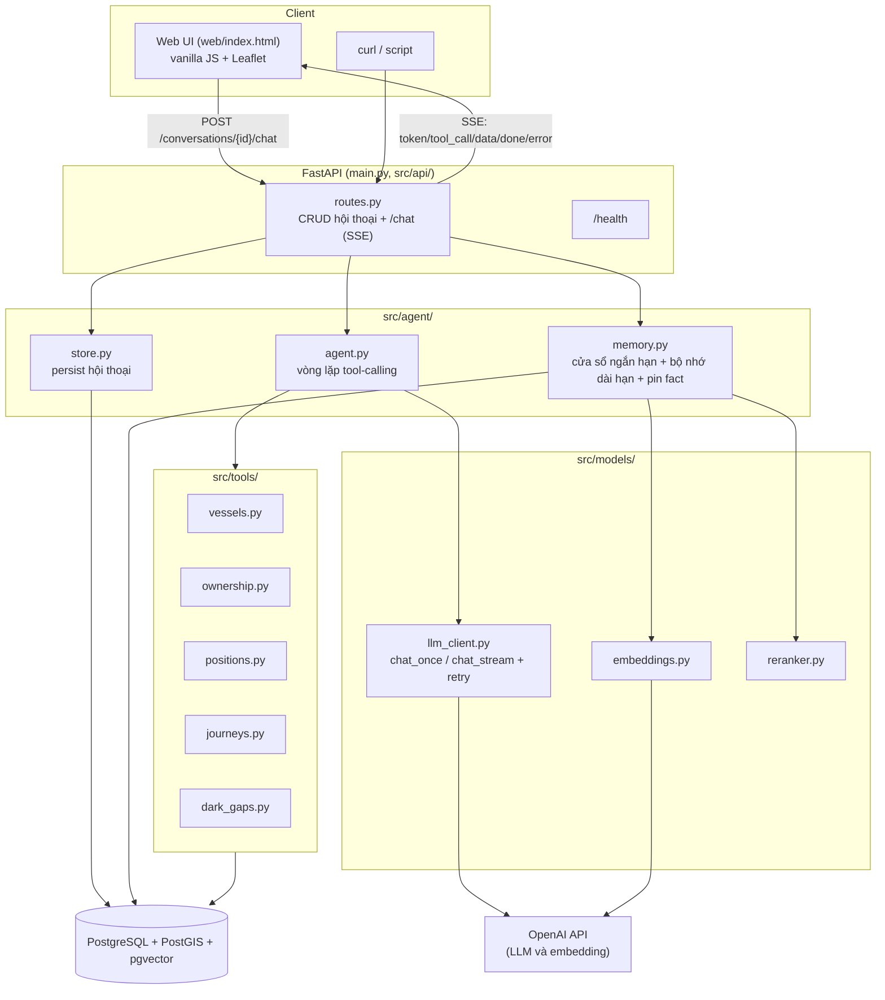
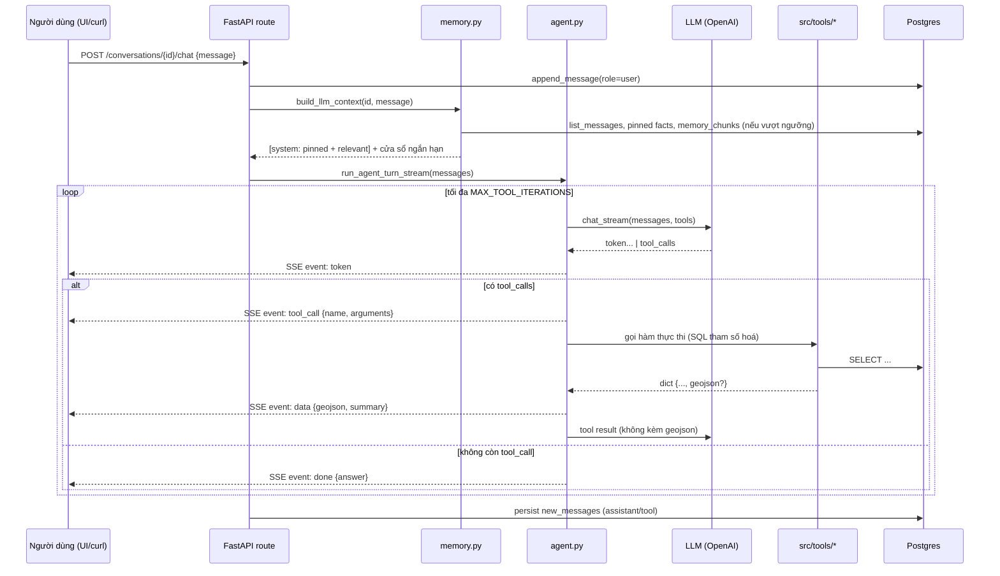

# Kiến trúc hệ thống

## 1. Sơ đồ thành phần



Hệ thống không sử dụng framework agent (LangChain, LangGraph). Vòng lặp
tool-calling được cài đặt trực tiếp trong `src/agent/agent.py` (khoảng 135
dòng) nhằm đảm bảo mọi bước xử lý đều tường minh và có thể giải thích được.
Phân tích lựa chọn: `docs/research.md`, mục 5.

## 2. Luồng xử lý một câu hỏi



Dữ liệu bản đồ (GeoJSON) được tách khỏi nội dung gửi cho LLM
(`agent.py::_split_geojson`): LLM chỉ nhận phần tóm tắt (số tàu, số điểm,
khung toạ độ), toạ độ chi tiết được gửi thẳng tới giao diện qua sự kiện
`data`, đáp ứng yêu cầu "dữ liệu lớn không đi qua model". Sự kiện `data`
mang thêm trường `summary` — chính là phần tóm tắt đó — để giao diện hiển
thị số liệu thống kê cạnh bản đồ mà không cần tính toán lại.

## 3. Thiết kế bộ nhớ hội thoại

`src/agent/memory.py::build_llm_context()` thực hiện các bước sau:

1. **Cửa sổ ngắn hạn**: nếu tổng số message không vượt quá
   `CONTEXT_WINDOW_TURNS` (tính theo số message, không phải số lượt hỏi
   đáp), toàn bộ lịch sử được giữ nguyên văn.
2. **Khi vượt ngưỡng**: mỗi message của người dùng nằm ngoài cửa sổ được
   đối chiếu với biểu thức chính quy nhận diện yêu cầu ghi nhớ (không phân
   biệt có dấu/không dấu tiếng Việt).
   - Nếu khớp: nội dung được lưu thành một fact tường minh trong
     `memory_chunks` (`is_pinned = true`), không qua bước tóm tắt.
   - Nếu không khớp: được gộp vào lô tóm tắt gia tăng (chỉ phần mới rơi
     ra khỏi cửa sổ ở mỗi lượt), tóm tắt bằng LLM, nhúng vector, và lưu
     vào `memory_chunks` với `is_pinned = false`.
3. **Truy xuất khi trả lời**:
   - Toàn bộ fact có `is_pinned = true` của hội thoại được lấy không điều
     kiện, không lọc theo độ tương đồng.
   - Các đoạn tóm tắt (`is_pinned = false`) được truy xuất bằng cách nhúng
     câu hỏi hiện tại, lấy top-20 ứng viên theo cosine similarity qua
     pgvector, sau đó xếp hạng lại bằng cross-encoder khi tính năng rerank
     được bật, và giữ lại top-3.
   - Hai nhóm kết quả được gộp (loại trùng theo id) thành một message hệ
     thống đặt trước cửa sổ ngắn hạn.
4. Việc cắt cửa sổ được thực hiện an toàn: không bao giờ cắt giữa cặp
   message `assistant` (có tool_calls) và message `tool` tương ứng.

Phân tích so sánh các chiến lược bộ nhớ đã cân nhắc, các vấn đề phát hiện
qua kiểm thử và cơ sở kỹ thuật của cơ chế pin fact: `docs/research.md`,
mục 6.

## 4. Schema cơ sở dữ liệu

Chi tiết đầy đủ: [`db/schema.sql`](../db/schema.sql). Các quyết định thiết
kế chính:

- **Mô hình staging**: dữ liệu CSV được nạp vào bảng trung gian (toàn bộ
  cột kiểu `text`) trước khi ép kiểu và làm sạch trong bước
  `INSERT ... SELECT` sang bảng chính, nhằm cô lập các trường hợp dữ liệu
  không đồng nhất trong CSV nguồn (ô rỗng, số ở dạng `"9605047.0"`).
- **Cột hình học sinh tự động** (`geom`, `start_geom`, `end_geom`,
  `gap_line`) được tính trực tiếp từ toạ độ kinh/vĩ độ khi ghi dữ liệu,
  không cần xử lý riêng ở tầng ứng dụng.
- **Chỉ mục**: GiST cho các cột hình học, B-tree cho cặp
  `(vessel_id, event_ts)`, GIN trigram cho `shipname` và `company_name`
  phục vụ tìm kiếm gần đúng.
- Các bảng ứng dụng (`conversations`, `messages`, `memory_chunks`) tách
  biệt hoàn toàn khỏi dữ liệu tàu biển, có khoá ngoại với `ON DELETE
  CASCADE`.
- `memory_chunks.is_pinned` (boolean, mặc định `false`) đánh dấu fact
  tường minh, được truy xuất không qua bước lọc độ tương đồng.
- Pipeline nạp dữ liệu là idempotent: bảng đích được `TRUNCATE` trước mỗi
  lần nạp lại; các câu lệnh `ALTER TABLE ... ADD COLUMN IF NOT EXISTS`
  đảm bảo migration an toàn trên cơ sở dữ liệu đã tồn tại.

## 5. Danh sách tool

| Tool | Tham số chính | Chức năng |
|---|---|---|
| `search_vessel` | tên/MMSI/IMO | Tìm tàu theo tên (chấp nhận sai lệch nhỏ), MMSI hoặc IMO |
| `get_vessel_info` | vessel_id | Thông tin tĩnh và toàn bộ quan hệ sở hữu của một tàu |
| `get_company_vessels` | tên công ty, vai trò (tuỳ chọn) | Danh sách tàu theo công ty, tự động nhận diện biến thể tên |
| `list_vessels_by_type` | từ khoá loại tàu (tiếng Anh) | Lọc tàu theo loại; kết quả kèm `total_matched`/`has_more` phản ánh đúng mức độ đầy đủ |
| `get_position_at_time` | vessel_id, thời điểm (tuỳ chọn) | Có `at_ts`: vị trí gần thời điểm được hỏi, nội suy tuyến tính khi thời điểm nằm giữa hai bản tin AIS. Không truyền `at_ts`: trả về điểm AIS mới nhất hiện có, phục vụ câu hỏi về vị trí hiện tại |
| `get_journey` | một vessel_id, khoảng thời gian | Hành trình của một tàu duy nhất, kèm dữ liệu GeoJSON |
| `get_multi_journey_geojson` | danh sách vessel_id, khoảng thời gian, `page`/`page_size` | Hành trình của nhiều tàu, có phân trang thật qua `has_more`/`total_vessels_requested` |
| `compare_journeys` | danh sách vessel_id hoặc `ship_type_substring`, khoảng thời gian | So sánh quãng đường và tốc độ trung bình của nhiều tàu, tính toán và xếp hạng trong một câu truy vấn SQL. Ở chế độ lọc theo loại tàu, số liệu tổng hợp được tính trên toàn bộ tập kết quả, không giới hạn số lượng |
| `get_dark_gaps` | vessel_id (tuỳ chọn), tiêu chí sắp xếp | Các sự kiện mất tín hiệu AIS, kèm dữ liệu GeoJSON |

Nguyên tắc chung áp dụng cho toàn bộ tool: câu lệnh SQL tham số hoá, chỉ
thực hiện truy vấn đọc có giới hạn số dòng, trả về giá trị rỗng khi không
có dữ liệu phù hợp thay vì suy diễn. Tool nào trả về trường `geojson` sẽ
tự động được tách sang sự kiện `data` kèm `summary` ở tầng agent.

`SYSTEM_PROMPT` (`src/prompts/system_prompts.py`) quy định các ràng buộc
hành vi tương ứng với từng nhóm yêu cầu:

- Đại từ chỉ định ("tàu đó", "công ty đó") phải được gán cho đối tượng vừa
  được xác nhận trong câu trả lời liền trước, không phải đối tượng gần
  nhất theo thứ tự gọi tool.
- Câu hỏi về vị trí bắt buộc phải nêu rõ toạ độ trong câu trả lời cuối
  cùng.
- Câu hỏi liên quan từ hai tàu trở lên bắt buộc sử dụng `compare_journeys`
  hoặc `get_multi_journey_geojson`, không được gọi lặp lại `get_journey`
  rồi tổng hợp thủ công.
- Câu hỏi về vị trí hiện tại/gần nhất phải gọi `get_position_at_time`
  không kèm `at_ts`, không được tự suy đoán một mốc thời gian.
- Số liệu thống kê tổng hợp trên một tập hợp lớn tàu chỉ được nêu khi có
  tool trả về đúng số liệu đó; không được tự ước lượng.

## 6. API

| Endpoint | Chức năng |
|---|---|
| `GET /health` | Kiểm tra tình trạng server và kết nối cơ sở dữ liệu |
| `POST /conversations` | Tạo hội thoại mới |
| `GET /conversations?limit&offset` | Liệt kê hội thoại, có phân trang |
| `GET /conversations/{id}/messages` | Toàn bộ tin nhắn của một hội thoại |
| `DELETE /conversations/{id}` | Xoá hội thoại |
| `POST /conversations/{id}/chat` | Streaming SSE với các sự kiện `token`, `tool_call`, `data`, `done`, `error` |

Chi tiết định dạng request/response: [`docs/api.md`](api.md), hoặc tài
liệu OpenAPI tự sinh tại `/docs` khi server đang chạy.

## 7. Hạn chế đã biết

### 7.1. Đã khắc phục sau kiểm thử

| Vấn đề | Nguyên nhân | Biện pháp khắc phục |
|---|---|---|
| Câu trả lời về vị trí đôi khi bỏ sót toạ độ | Model mô tả trạng thái hành trình (tốc độ, hướng đi) nhưng không trích dẫn toạ độ mà tool đã trả về | Bổ sung ràng buộc bắt buộc nêu toạ độ trong `SYSTEM_PROMPT`; xác nhận qua `results/scenario_1.md` |
| `get_multi_journey_geojson` giới hạn cứng 50 tàu/lần gọi | Không có cơ chế lấy phần còn lại khi số tàu vượt giới hạn | Bổ sung phân trang qua `page`/`page_size`/`has_more`/`total_vessels_requested` |
| So sánh nhiều tàu không mở rộng được | Model gọi `get_journey` lần lượt cho từng tàu, dễ chạm giới hạn số lần lặp tool và dễ gán nhầm số liệu giữa các tàu khi tổng hợp thủ công | Bổ sung tool `compare_journeys`, tính toán và xếp hạng trong một câu truy vấn SQL |
| Model tự ước lượng số liệu tổng hợp khi tập tàu vượt giới hạn hiển thị chi tiết | Không có tool nào tính đúng số liệu tổng hợp trên toàn bộ tập kết quả khi vượt giới hạn hiển thị | `compare_journeys` bổ sung chế độ lọc theo loại tàu, tính tổng/trung bình trên SQL không giới hạn số lượng; bổ sung kiểm chứng tự động theo tool được gọi (không chỉ theo nội dung câu trả lời) trong `scripts/verify_results.py` |
| `get_position_at_time` buộc model phải suy đoán mốc thời gian cho câu hỏi về vị trí hiện tại | Không có tham số thời gian cụ thể trong câu hỏi, model phải tự chọn một giá trị `at_ts`, có khả năng chọn sai | Bổ sung chế độ không truyền `at_ts`, trả về trực tiếp điểm AIS mới nhất |
| `OPENAI_BASE_URL` để trống trong `.env` vẫn gây lỗi kết nối | OpenAI SDK đọc trực tiếp biến môi trường này; một biến rỗng nhưng tồn tại khiến SDK dùng chuỗi rỗng làm base URL | `src/models/llm_client.py::get_client` xoá biến môi trường rỗng trước khi khởi tạo client; bổ sung unit test hồi quy |

### 7.2. Hạn chế còn tồn tại

- **Gán nhầm số liệu hoặc định danh tàu khi xử lý nhiều kết quả cùng lúc.**
  Ghi nhận qua kiểm thử với `gpt-4o-mini`: có trường hợp model tổng hợp
  thủ công nhiều kết quả `get_journey` và gán nhầm quãng đường của một tàu
  cho tên tàu khác; có trường hợp khác gọi đúng `get_position_at_time`
  nhưng truyền `vessel_id` của một tàu khác với tàu vừa được xác nhận
  trong câu trả lời liền trước. Đây là lỗi thuộc năng lực suy luận của
  model, không phải lỗi thiết kế hệ thống; các ràng buộc bổ sung trong
  `SYSTEM_PROMPT` làm giảm xác suất xảy ra nhưng không loại bỏ hoàn toàn.
  Phân tích chi tiết và hướng khắc phục kỹ thuật cụ thể: `docs/research.md`,
  mục 1.4, 1.5 và 6.4.
- **Không có cơ chế xác thực và giới hạn tần suất truy cập.** Mọi
  `conversation_id` đều có thể được truy cập mà không cần xác thực. Chấp
  nhận được trong phạm vi bài kiểm tra, không phù hợp cho môi trường sản
  xuất.
- **Không sử dụng connection pool.** Mỗi lời gọi tool mở và đóng một kết
  nối Postgres riêng biệt. Phù hợp ở quy mô hiện tại; ở tải cao cần bổ
  sung `psycopg2.pool` hoặc PgBouncer.
- **Không có observability đầy đủ.** Hệ thống ghi log dạng văn bản
  (`src/utils/logger.py`), chưa có structured logging, metrics hay
  tracing.
- **Tính năng rerank hiện đang tắt** (`RERANKER_ENABLED=false`). OpenAI
  không cung cấp API rerank; nhà cung cấp trước đó (Cloudflare Workers AI)
  cũng ngừng khả dụng do hết hạn mức miễn phí tại thời điểm chuyển đổi.
  Tác động được giảm thiểu phần lớn nhờ cơ chế pin fact tường minh. Phân
  tích đánh đổi: `docs/research.md`, mục 4.3.
- **Cơ chế thử lại (retry) cho lỗi mạng/máy chủ tạm thời** đã được bổ
  sung (`tenacity`, tối đa 3 lần, backoff tăng dần), chỉ áp dụng cho lỗi
  5xx và lỗi kết nối. Trong một lần kiểm thử, lỗi từ phía nhà cung cấp kéo
  dài hơn tổng thời gian của cả 3 lần thử lại — cho thấy nhu cầu bổ sung
  cơ chế cảnh báo và khả năng chuyển sang nhà cung cấp dự phòng ở môi
  trường sản xuất. Xem thêm định hướng self-host tại `docs/research.md`,
  mục 9.
- **Giao diện người dùng (N1)** đã được xây dựng hoàn chỉnh (hiển thị
  markdown, khối "quá trình xử lý" cho các bước gọi tool, giao diện dạng
  tối) nhưng chưa được xác nhận trực tiếp trên trình duyệt trong môi
  trường phát triển hiện tại; đã được xác nhận đầy đủ ở tầng API qua
  `curl` và kiểm tra cấu trúc sự kiện SSE.

So sánh chi tiết giữa `gpt-oss-20b` và `gpt-4o-mini`, bao gồm các vấn đề
phát hiện qua kiểm thử: `docs/research.md`, mục 1.3 và 1.4.

## 8. Độ trễ và chi phí ước tính

### 8.1. Số liệu đo thực tế

Số liệu ban đầu được đo với Cloudflare Workers AI (`gpt-oss-20b`, `bge-m3`,
`bge-reranker-base`), trước khi chuyển sang OpenAI (xem mục 7 và
`docs/research.md`, mục 1.4). Bậc độ lớn được xem là tương đương với cấu
hình hiện tại; số liệu chi tiết chưa được đo lại sau khi chuyển đổi nhà
cung cấp.

| Tác vụ | Thời gian đo được |
|---|---|
| Nạp dữ liệu bằng COPY (171.000 dòng) | 1,14 giây |
| Toàn bộ pipeline nạp dữ liệu (schema, 4 tệp CSV, ép kiểu, chỉ mục) | khoảng 16 giây |
| Một lượt hội thoại đơn giản (một lần gọi tool) | 3–8 giây |
| Một lượt hội thoại phức tạp (nhiều lần gọi tool, ví dụ N3) | 15–25 giây |
| Tóm tắt và nhúng một đoạn hội thoại cũ | 5–8 giây |

### 8.2. Mô hình chi phí

Giá niêm yết của OpenAI tại thời điểm biên soạn tài liệu (cần đối chiếu
giá hiện hành trước khi áp dụng cho quyết định thực tế):

- `gpt-4o-mini`: 0,15 USD/triệu token đầu vào, 0,6 USD/triệu token đầu ra.
- `text-embedding-3-small`: 0,02 USD/triệu token.
- Rerank: không áp dụng do đang tắt.

Giá của cấu hình ban đầu (Cloudflare Workers AI, `gpt-oss-20b`), giữ lại
để đối chiếu:

- `gpt-oss-20b`: 0,2 USD/triệu token đầu vào, 0,3 USD/triệu token đầu ra.
- `bge-m3` (embedding): tính theo đơn vị neuron, chi phí không đáng kể.
- `bge-reranker-base`: 0,00311 USD/triệu token đầu vào.

Công thức ước tính chi phí LLM cho một lượt hỏi trung bình (dựa trên quan
sát thực tế: một lượt đơn giản sử dụng khoảng 800–1500 token đầu vào gồm
system prompt, đặc tả tool và lịch sử ngắn hạn; khoảng 150–400 token đầu
ra):

```
chi_phi_1_luot ≈ (token_input / 1.000.000 × 0,2) + (token_output / 1.000.000 × 0,3)
              ≈ (1200 / 1.000.000 × 0,2) + (250 / 1.000.000 × 0,3)
              ≈ 0,00031 USD/lượt
```

Ở quy mô đánh giá (ước tính vài trăm lượt hỏi), tổng chi phí LLM dưới 1
USD.

Ngoại suy cho quy mô vận hành nhỏ (10.000 lượt hỏi/ngày):

```
10.000 lượt/ngày × 0,00031 USD/lượt ≈ 3,1 USD/ngày ≈ 93 USD/tháng (chỉ tính LLM)
```

Chi phí embedding ở quy mô này không đáng kể. Chi phí hạ tầng cơ sở dữ
liệu phụ thuộc lựa chọn nhà cung cấp cụ thể, không được ước tính trong tài
liệu này. Các con số trên chỉ nhằm minh hoạ bậc độ lớn, không phải cam kết
chi phí thực tế.

## 9. Hướng mở rộng khi dữ liệu đạt quy mô vài chục triệu điểm/ngày

### 9.1. Ước tính quy mô

Mỗi dòng trong bảng `ais_positions` gồm 11 cột dữ liệu và một cột hình học
sinh tự động, kích thước thô ước tính 150–200 byte mỗi dòng (bao gồm chi
phí chỉ mục). Với mốc 30 triệu điểm/ngày:

```
Dữ liệu thô mỗi ngày                          ≈ 30.000.000 × 180 byte ≈ 5,4 GB/ngày
Chi phí chỉ mục (GiST, B-tree)                ≈ thêm 30-50% dung lượng
Tổng thực tế mỗi ngày                         ≈ 7-8 GB/ngày
Lưu trữ một năm, không downsample             ≈ 2,5-3 TB
```

Ở quy mô này, việc lưu trữ trên một node PostgreSQL đơn lẻ không phân
vùng và không giảm mật độ dữ liệu là không khả thi. Đây là ước tính bậc độ
lớn nhằm minh hoạ mức độ cần thiết của các hướng mở rộng dưới đây; dữ liệu
sử dụng trong bài kiểm tra này có quy mô nhỏ hơn khoảng 500 lần (3 ngày,
xấp xỉ 57.000 điểm/ngày).

### 9.2. Các hướng mở rộng

- **Phân vùng bảng `ais_positions` theo thời gian** (range partition theo
  ngày hoặc tuần), giữ kích thước chỉ mục nhỏ trên từng phân vùng; truy
  vấn theo khoảng thời gian chỉ cần quét đúng phân vùng liên quan nhờ cơ
  chế partition pruning của PostgreSQL.
- **Nạp dữ liệu theo luồng thay vì theo lô.** Dữ liệu AIS thực tế phát
  sinh liên tục; cần pipeline nạp tăng dần (ví dụ qua Kafka) thay vì nạp
  lại toàn bộ tệp như thiết kế hiện tại — vốn phù hợp cho việc nạp một
  lần từ tệp CSV tĩnh.
- **Read replica** cho tầng truy vấn, tách khỏi luồng ghi dữ liệu, tránh
  tranh chấp tài nguyên giữa việc nạp dữ liệu liên tục và truy vấn của
  người dùng.
- **Giảm mật độ dữ liệu trước khi lưu trữ dài hạn.** Dữ liệu vị trí quá
  một ngưỡng tuổi nhất định có thể được giảm tần suất điểm khi lưu trữ,
  không chỉ khi trả kết quả (kỹ thuật `ST_Simplify` hiện chỉ áp dụng ở
  bước trả kết quả trong `get_multi_journey_geojson`).
- **Connection pool và driver bất đồng bộ** (`asyncpg`) nếu tải đồng thời
  tăng cao; mô hình hiện tại — mỗi lời gọi tool mở một kết nối riêng qua
  `psycopg2` đồng bộ — phù hợp ở quy mô hiện tại nhưng sẽ nghẽn ở vài trăm
  yêu cầu đồng thời.
- **Cơ chế cache** (Redis) cho các truy vấn phổ biến, ít thay đổi trong
  ngày.
- **Vector database chuyên dụng** (Qdrant, Milvus) thay cho pgvector nếu
  số lượng hội thoại đồng thời tăng mạnh. So sánh chi tiết:
  `docs/research.md`, mục 3.
