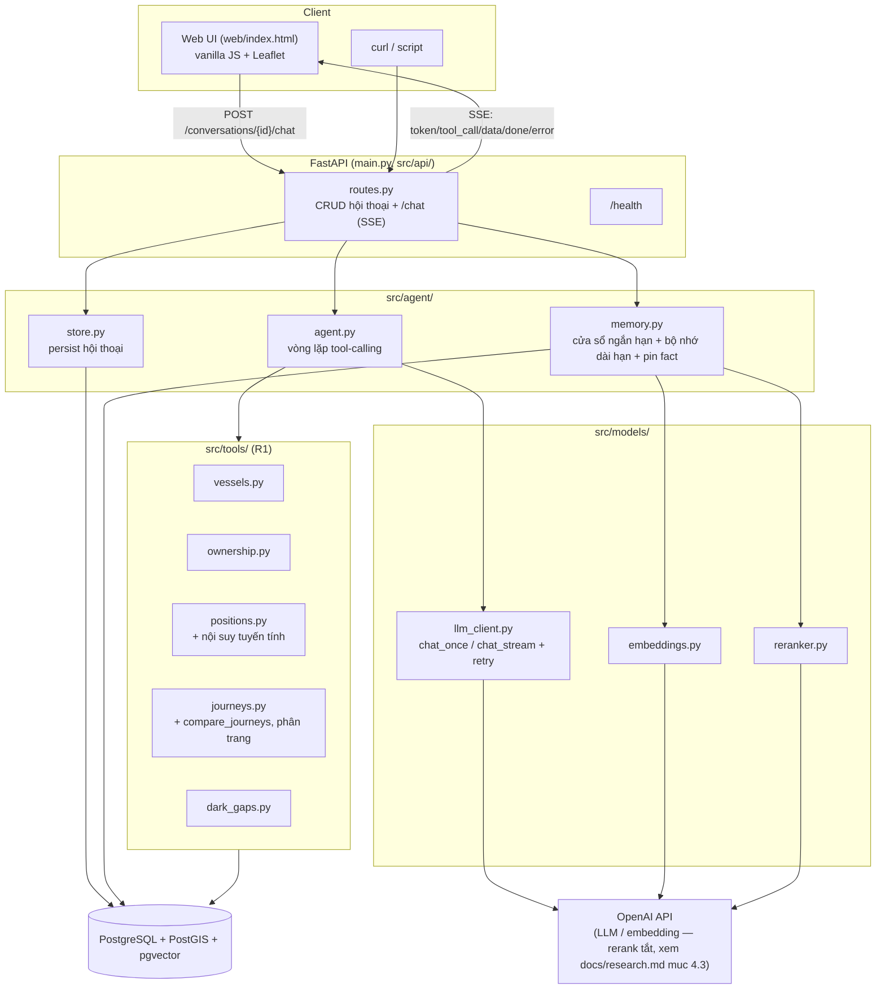
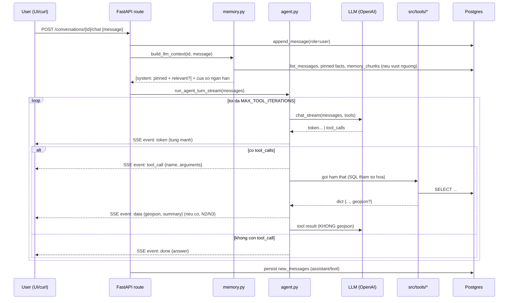

# Kiến trúc hệ thống

## 1. Sơ đồ thành phần



**Không dùng framework agent (LangChain/LangGraph)** — vòng lặp tool-calling
tự viết (~135 dòng, `src/agent/agent.py`) để giải thích được từng bước; lý do
đầy đủ: `docs/research.md` mục 5.

## 2. Luồng xử lý 1 câu hỏi



Điểm quan trọng: **dữ liệu bản đồ (geojson) tách khỏi nội dung gửi LLM**
(`agent.py::_split_geojson`) — LLM chỉ thấy phần tóm tắt (số tàu, số điểm,
bbox), toạ độ chi tiết đi thẳng tới UI qua sự kiện `data`, đúng yêu cầu N2/N3
"dữ liệu lớn không đi qua model". Sự kiện `data` còn mang thêm `summary`
(chính là phần tóm tắt đó) để UI vẽ thẻ thống kê cạnh bản đồ mà không cần tự
tính lại hay suy diễn thêm số liệu.

## 3. Thiết kế bộ nhớ (R3)

`src/agent/memory.py::build_llm_context()`:

1. **Cửa sổ ngắn hạn**: nếu tổng số message ≤ `CONTEXT_WINDOW_TURNS` (đếm
   theo message, không phải "lượt"), dùng nguyên văn toàn bộ lịch sử.
2. **Vượt ngưỡng**: với các message cũ hơn cửa sổ, mỗi message của user được
   kiểm tra qua regex nhận diện câu "ghi nhớ" (không dấu, bắt cả 2 dạng có
   dấu/không dấu):
   - **Khớp** → lưu thẳng thành 1 **fact tường minh** (`memory_chunks`,
     `is_pinned = true`), không qua bước tóm tắt.
   - **Không khớp** → gộp vào lô **tóm tắt gia tăng** (chỉ phần mới rơi ra
     khỏi cửa sổ mỗi lần) bằng LLM → nhúng vector (`bge-m3`, tóm tắt viết
     bằng **tiếng Anh** — lý do: `docs/research.md` mục 4.2) → lưu
     `memory_chunks` với `is_pinned = false`.
3. **Truy xuất khi trả lời**:
   - Mọi fact có `is_pinned = true` của hội thoại: **luôn lấy toàn bộ**,
     không lọc theo similarity.
   - Các chunk `is_pinned = false`: nhúng câu hỏi hiện tại → lấy top-20 ứng
     viên theo cosine similarity (pgvector `<=>`) → **rerank** bằng
     cross-encoder (`bge-reranker-base`) → lấy top-3.
   - Gộp cả 2 nhóm (loại trùng theo `id`), chèn thành 1 message `system` đặt
     TRƯỚC cửa sổ ngắn hạn, có câu dẫn nhấn mạnh đây là thông tin người dùng
     yêu cầu ghi nhớ.
4. Cắt cửa sổ **an toàn**: không bao giờ cắt giữa cặp
   `assistant(tool_calls)`/`tool`-result.

**So sánh các chiến lược bộ nhớ đã cân nhắc, case study 3 bug thật tìm được,
và lý do bổ sung cơ chế pin fact**: xem `docs/research.md` mục 6 (phần này
đã được viết lại đầy đủ và chi tiết hơn nhiều so với bản trước, gồm cả
phương pháp thử nghiệm và bảng root-cause).

## 4. Schema database

Xem đầy đủ tại [`db/schema.sql`](../db/schema.sql). Tóm tắt quyết định thiết kế:

- **Staging pattern**: COPY CSV vào bảng staging (toàn cột `text`) trước,
  ép kiểu/làm sạch khi `INSERT...SELECT` sang bảng chính — cách ly lỗi kiểu
  dữ liệu do CSV nhiễu (ô rỗng, số dạng `"9605047.0"`).
- **Generated columns** cho hình học (`geom`, `start_geom`, `end_geom`,
  `gap_line`) — tự tính từ lon/lat khi insert, không cần code riêng.
- **Index**: GiST cho cột hình học, B-tree cho `(vessel_id, event_ts)`, GIN
  trigram cho `shipname`/`company_name` (fuzzy search).
- Bảng ứng dụng (`conversations`, `messages`, `memory_chunks`) tách biệt
  hoàn toàn khỏi dữ liệu tàu biển (R1), có FK `ON DELETE CASCADE`.
- `memory_chunks.is_pinned` (boolean, mặc định `false`): đánh dấu fact tường
  minh (mục 3) — luôn được truy xuất, bỏ qua bước lọc similarity/rerank.
- Idempotent: pipeline luôn `TRUNCATE` bảng đích trước khi nạp lại;
  `ALTER TABLE ... ADD COLUMN IF NOT EXISTS` cho migration an toàn trên DB
  đã tồn tại (vd. khi thêm `is_pinned` sau này mà không cần drop bảng).

## 5. Danh sách tool

| Tool | Input chính | Đáp ứng |
|---|---|---|
| `search_vessel` | tên/MMSI/IMO | Tìm tàu linh hoạt, fuzzy (R1) |
| `get_vessel_info` | vessel_id | Thông tin tĩnh + ownership đầy đủ |
| `get_company_vessels` | tên công ty, role? | Tàu theo công ty, tự tìm biến thể tên |
| `list_vessels_by_type` | từ khoá loại tàu (EN) | Lọc theo loại tàu (N3); trả kèm `total_matched`/`has_more` — không còn âm thầm cắt bớt |
| `get_position_at_time` | vessel_id, thời điểm (tuỳ chọn) | **Có `at_ts`**: vị trí gần thời điểm đó, **nội suy tuyến tính** giữa 2 điểm bao quanh nếu có đủ cả 2 (điểm cộng theo đề bài), kèm cờ `is_interpolated`/`is_stale`. **Không truyền `at_ts`**: trả đúng điểm AIS MỚI NHẤT hiện có — dùng cho câu hỏi "vị trí hiện tại/cuối cùng", không cần model tự đoán 1 mốc thời gian |
| `get_journey` | 1 vessel_id, khoảng thời gian | 1 hành trình, kèm GeoJSON. Mô tả tool nhấn mạnh CHỈ dùng cho 1 tàu — nếu nhiều tàu phải dùng `compare_journeys`/`get_multi_journey_geojson` |
| `get_multi_journey_geojson` | list vessel_id, khoảng thời gian, `page`/`page_size` | Nhiều hành trình (N3), **phân trang thật** qua `has_more`/`total_vessels_requested` thay vì cắt cứng, đơn giản hoá đường bằng `ST_Simplify` |
| `compare_journeys` | list vessel_id HOẶC `ship_type_substring`, khoảng thời gian | So sánh quãng đường/tốc độ nhiều tàu, **tính và xếp hạng sẵn trong 1 câu SQL**. Chế độ `ship_type_substring` tính SUM/AVG/MAX/MIN trên **toàn bộ** tàu khớp (không giới hạn số lượng, kể cả hàng trăm tàu) — chỉ rút gọn phần hiển thị chi tiết, tránh agent phải gọi `get_journey` lặp từng tàu (dễ chạm `MAX_TOOL_ITERATIONS` hoặc tự bịa số liệu tổng hợp) |
| `get_dark_gaps` | vessel_id?, order_by | Sự kiện mất tín hiệu AIS, kèm GeoJSON |

Nguyên tắc chung: SQL tham số hoá, chỉ SELECT có LIMIT, không dữ liệu thì trả
`None`/`[]` (R4). Tool nào trả `geojson` sẽ tự động được tách sang sự kiện
`data` kèm `summary` (N2/N3), không cần khai báo gì thêm ở tầng agent.

`SYSTEM_PROMPT` (`src/prompts/system_prompts.py`) có nhiều quy tắc bổ sung
sau review, mỗi quy tắc gắn trực tiếp với 1 lỗi THẬT đã phát hiện (không
phải quy tắc phòng ngừa lý thuyết):
- Quy tắc 6 (mở rộng): "tàu đó" luôn trỏ tới tàu vừa XÁC NHẬN trong câu trả
  lời ngay trước, không phải tàu gần nhất trong lịch sử gọi tool — sửa lỗi
  thật khi đổi sang `gpt-4o-mini` (xem `docs/research.md` mục 6.4).
- Quy tắc 8: bắt buộc nêu rõ toạ độ khi trả lời câu hỏi vị trí.
- Quy tắc 9: khi câu hỏi liên quan ≥ 2 tàu, bắt buộc dùng `compare_journeys`/
  `get_multi_journey_geojson`, cấm tự gọi `get_journey` lặp lại rồi tổng hợp
  bằng tay — sửa lỗi thật gán nhầm số liệu giữa các tàu (mục 1.4).
- Quy tắc 10: câu hỏi vị trí hiện tại/cuối cùng gọi `get_position_at_time`
  KHÔNG kèm `at_ts`, cấm tự đoán mốc thời gian.
- Quy tắc 11: cấm tự ước lượng số liệu tổng hợp trên tập tàu lớn nếu không
  có tool nào thực sự tính ra con số đó — bắt buộc dùng
  `compare_journeys(ship_type_substring=...)`.

## 6. API

| Endpoint | Việc |
|---|---|
| `GET /health` | Health check (kiểm tra kết nối DB) |
| `POST /conversations` | Tạo hội thoại |
| `GET /conversations?limit&offset` | Liệt kê (có phân trang) |
| `GET /conversations/{id}/messages` | Toàn bộ tin nhắn |
| `DELETE /conversations/{id}` | Xoá hội thoại |
| `POST /conversations/{id}/chat` | Streaming SSE: `token`, `tool_call`, `data`, `done`, `error` |

Chi tiết request/response: xem [`docs/api.md`](api.md) hoặc OpenAPI tự sinh
tại `/docs` khi chạy server.

## 7. Hạn chế đã biết

Ghi trung thực để không đánh giá quá cao mức độ hoàn thiện — mục này đã được
cập nhật sau 1 vòng review độc lập, các mục có nhãn **[ĐÃ SỬA]** là phát hiện
thật từ vòng review đó và đã khắc phục, kèm bằng chứng.

- **[ĐÃ SỬA] Câu hỏi vị trí đôi khi bỏ sót toạ độ trong câu trả lời cuối** —
  phát hiện thật khi soát lại `results/scenario_1.md` lượt 4: tool
  `get_position_at_time` trả về đúng lat/lon, nhưng model chỉ mô tả
  `nav_status`/tốc độ rồi bỏ qua toạ độ, lạc đề so với câu hỏi "đang ở đâu".
  Đã thêm quy tắc 8 vào `SYSTEM_PROMPT` bắt buộc nêu rõ toạ độ. Xác nhận:
  chạy lại, lượt này PASS với toạ độ cụ thể (`results/verify_summary.txt`).
- **[ĐÃ SỬA] `get_multi_journey_geojson` giới hạn cứng 50 tàu/lần** — trước
  đây chỉ 50 tàu đầu tiên được vẽ khi hỏi "toàn bộ tàu cargo" (628 tàu trong
  data), phần còn lại bị bỏ qua âm thầm. Đã thêm phân trang thật
  (`page`/`page_size`/`has_more`/`total_vessels_requested`) — model có thể tự
  gọi lại với `page+1` khi cần đầy đủ.
- **[ĐÃ SỬA] So sánh chỉ tiêu trên nhiều tàu không scale** — trước đây hỏi
  "trong N tàu, tàu nào xa nhất" khiến model gọi `get_journey` TỪNG TÀU MỘT,
  chạm `MAX_TOOL_ITERATIONS=8` với N lớn → trả sự kiện `error`. Đã thêm tool
  `compare_journeys` tính và xếp hạng ngay trong 1 câu SQL.
- **[ĐÃ SỬA] Model tự bịa số liệu tổng hợp khi tập tàu vượt giới hạn hiển
  thị chi tiết** — phát hiện nghiêm trọng khi soát tay `results/scenario_5.md`
  (không nằm trong kiểm chứng tự động cũ): model từng tự bịa "~3.200 tàu,
  ~5.200.000 hải lý" (trong khi cả dataset chỉ có 1.000 tàu) khi được hỏi
  tổng hợp trên toàn bộ tàu Cargo. Đã sửa bằng `compare_journeys
  (ship_type_substring=...)` tính SUM/AVG/MAX thật trên SQL (không giới
  hạn số lượng) + thêm kiểm chứng tự động theo TOOL ĐÃ GỌI (không chỉ nội
  dung câu trả lời) vào `scripts/verify_results.py`/`run_scenarios.py` để
  bắt được đúng loại lỗi này trong tương lai (nội dung "nghe hợp lý" không
  đủ để phát hiện qua string-match).
- **[ĐÃ SỬA] `get_position_at_time` buộc model phải đoán mốc thời gian cho
  câu hỏi "vị trí cuối cùng"** — không có tham số thời gian cụ thể trong câu
  hỏi khiến model tự đoán 1 `at_ts`, có lần đoán sai (chọn mốc đầu thay vì
  cuối) và trả về vị trí CŨ NHẤT thay vì MỚI NHẤT. Đã thêm chế độ
  `at_ts=None` trả đúng điểm AIS mới nhất, loại bỏ hẳn nhu cầu đoán mò.
- **[GHI NHẬN, CHƯA SỬA DỨT ĐIỂM — giới hạn suy luận của LLM] Gán nhầm số
  liệu/vessel_id giữa các tàu khi phải xử lý nhiều kết quả cùng lúc** — phát
  hiện thật sau khi đổi sang `gpt-4o-mini`: (1) 1 lần chạy tự gộp 29 kết quả
  `get_journey` rồi gán nhầm quãng đường của "EVER GLOBE" cho tên
  "EVER GIFTED" (số liệu thật, tên sai); (2) 1 lần chạy khác gọi đúng
  `get_position_at_time` (không đoán `at_ts`, dùng đúng cơ chế mới) nhưng
  truyền nhầm `vessel_id` của tàu vừa được hỏi ở lượt trước thay vì tàu vừa
  được chính nó xác nhận đúng bằng lời 1 lượt ngay trước đó. Đã thêm quy tắc
  cụ thể vào `SYSTEM_PROMPT` (quy tắc 6, 9) nhắm đúng 2 lỗi này, nhưng đây
  là lỗi suy luận/liên kết ngữ cảnh của model — không có sửa nào đảm bảo
  100%, chỉ giảm xác suất. Phân tích đầy đủ + so sánh với `gpt-oss-20b`:
  `docs/research.md` mục 1.4 và 6.4.
- **[ĐÃ SỬA] `OPENAI_BASE_URL` để trống ("=") vẫn gây lỗi** — OpenAI SDK tự
  đọc thẳng biến môi trường này, và biến RỖNG NHƯNG TỒN TẠI khiến SDK dùng
  chuỗi rỗng làm base_url thật (lỗi "missing http(s):// protocol"), bất kể
  `src/utils/config.py::get_openai_base_url()` đã tự chuyển `"" -> None`
  đúng. Phát hiện thật khi đổi sang OpenAI (làm theo đúng hướng dẫn cũ của
  `.env.example`). Đã sửa ở `src/models/llm_client.py::get_client` (tự xoá
  biến rỗng khỏi `os.environ` trước khi tạo client) + cập nhật hướng dẫn
  trong `.env.example` + thêm unit test hồi quy.
- **Rerank đang TẮT** (`RERANKER_ENABLED=false`) — OpenAI không có sản phẩm
  rerank (chỉ chat + embedding), và Cloudflare (nơi có `bge-reranker-base`)
  cũng đang hết hạn ngạch miễn phí cùng lúc đổi provider. Bù đắp phần lớn
  bằng cơ chế pin fact tường minh (không cần rerank cho use case chính) —
  chi tiết đánh đổi: `docs/research.md` mục 4.3.
- **Không có auth/rate limiting** — bất kỳ ai cũng gọi được mọi
  `conversation_id`. Chấp nhận được cho bài test, KHÔNG chấp nhận được cho
  production thật.
- **Không có connection pool** — mỗi lời gọi tool mở/đóng 1 connection
  Postgres riêng. Ở quy mô bài test không vấn đề gì; tải cao cần
  `psycopg2.pool` hoặc PgBouncer (tính toán cụ thể: mục 9).
- **Đã thêm retry cho lỗi mạng/server tạm thời** (`tenacity`, 3 lần, backoff
  tăng dần) sau khi phát hiện thật 1 lỗi `500` thoáng qua làm crash kịch bản
  đang chạy. Chỉ retry lỗi 5xx/kết nối, không retry lỗi 4xx. **Lưu ý thật**: ở
  1 lần chạy khác (Kịch bản 5, lượt 2–3, khi còn dùng Cloudflare), lỗi 500
  KÉO DÀI hơn cả 3 lần retry (~10s) — rủi ro vận hành thật của hạ tầng
  inference dùng chung/giá rẻ, không phải lỗi code. Production thật cần
  alerting + có thể cần fallback provider — xem thêm hướng self-host ở
  `docs/research.md` mục 9.
- **Không có observability đầy đủ** — chỉ có log text (`src/utils/logger.py`),
  chưa có structured logging (JSON), metrics (Prometheus), hay tracing.
- **Quirk của `gpt-oss-20b` qua Cloudflare** (không còn dùng, giữ lại làm
  hồ sơ) và **so sánh chất lượng suy luận thật với `gpt-4o-mini`** — bảng
  đầy đủ: `docs/research.md` mục 1.3 và 1.4.
- **UI (N1) đã được viết lại (markdown render, hiển thị "quá trình xử lý"
  tool-call, giao diện tối) sau review, nhưng nên tự kiểm tra lại bằng mắt
  trên trình duyệt thật 1 lần trước khi bàn giao** — môi trường phát triển
  này verify được đầy đủ ở tầng API (curl, SSE, cấu trúc sự kiện) nhưng không
  có công cụ trình duyệt để tự chụp lại giao diện.

## 8. Độ trễ và chi phí ước tính

### 8.1. Đo thực tế trong quá trình phát triển

(Số liệu ban đầu, đo với Cloudflare Workers AI — `gpt-oss-20b` + `bge-m3` +
`bge-reranker-base` — trước khi đổi sang OpenAI, xem mục 7 và
`docs/research.md` mục 1.4. Bậc độ lớn tương tự với `gpt-4o-mini`, chưa đo
lại chi tiết từng mốc sau khi đổi provider):

| Việc | Thời gian đo thực tế |
|---|---|
| Nạp dữ liệu (COPY thuần, 171k dòng) | 1.14s |
| Toàn bộ pipeline nạp (schema + 4 CSV + ép kiểu + index) | ~16s |
| 1 lượt chat đơn giản (1 tool call) | ~3–8s |
| 1 lượt chat phức tạp (2 tool call, vd. N3 nhiều tàu) | ~15–25s |
| Tóm tắt + nhúng 1 đoạn hội thoại cũ (R3) | ~5–8s |

### 8.2. Mô hình chi phí

**Giá đang dùng thật (OpenAI, tại thời điểm viết tài liệu — cần đối chiếu
lại giá mới nhất trước khi dùng cho quyết định thật)**:
- `gpt-4o-mini`: $0.15 / triệu token input, $0.6 / triệu token output.
- `text-embedding-3-small`: $0.02 / triệu token — rất rẻ, không đáng kể ở
  quy mô bài test.
- Rerank: không áp dụng (đang tắt — mục 7).

**Giá ban đầu (Cloudflare Workers AI, khi còn dùng `gpt-oss-20b`, giữ lại
để đối chiếu)**:
- `gpt-oss-20b`: $0.2 / triệu token input, $0.3 / triệu token output.
- `bge-m3` (embedding): tính theo neurons, rất rẻ (~vài phần nghìn USD/1000 lượt).
- `bge-reranker-base`: $0.00311 / triệu token input.

**Công thức ước tính chi phí LLM cho 1 lượt hỏi trung bình** (quan sát thực
tế: 1 lượt đơn giản dùng ~800–1500 token input gồm system prompt + tool specs
+ lịch sử ngắn hạn, ~150–400 token output):

```
chi_phi_1_luot ≈ (token_input / 1_000_000 × 0.2) + (token_output / 1_000_000 × 0.3)
              ≈ (1200 / 1_000_000 × 0.2) + (250 / 1_000_000 × 0.3)
              ≈ $0.00031 / lượt
```

Với quy mô chấm bài (ước tính vài trăm lượt hỏi), chi phí LLM **dưới 1 USD**
— khớp với quan sát thực tế trong quá trình phát triển (đã chạy hàng trăm
lượt test mà không phát sinh chi phí đáng kể).

**Ngoại suy cho quy mô sản xuất nhỏ** (ví dụ 10.000 lượt hỏi/ngày — một đội
phân tích vài chục người dùng liên tục):

```
10,000 lượt/ngày × $0.00031/lượt ≈ $3.1/ngày ≈ $93/tháng (chỉ riêng LLM)
```

Cộng thêm embedding (rẻ không đáng kể ở quy mô này) và hạ tầng Postgres tự
quản lý (biến động theo nhà cung cấp, không ước tính ở đây vì phụ thuộc lựa
chọn hạ tầng cụ thể — xem mục 9). Con số trên chỉ để minh hoạ **bậc độ lớn**
(order of magnitude), không phải cam kết chi phí thật.

## 9. Hướng mở rộng khi dữ liệu lên vài chục triệu điểm/ngày

### 9.1. Ước tính quy mô

1 dòng `ais_positions` hiện có 11 cột dữ liệu + 1 cột hình học generated —
kích thước thô ước tính **~150–200 byte/dòng** (bao gồm overhead index).
Với "vài chục triệu điểm/ngày" (lấy mốc 30 triệu/ngày để tính):

```
Dữ liệu thô mỗi ngày   ≈ 30,000,000 × 180 byte ≈ 5.4 GB/ngày
Index (geom GiST + B-tree vessel_id/event_ts) ≈ thêm ~30-50% dung lượng
Tổng thực tế mỗi ngày  ≈ ~7-8 GB/ngày
Giữ 1 năm không downsample ≈ ~2.5-3 TB — KHÔNG khả thi trên 1 node Postgres
đơn lẻ không partition/không downsample.
```

Đây là con số ước tính bậc độ lớn để minh hoạ mức độ cấp thiết của các hướng
mở rộng dưới đây, không phải đo đạc trên hạ tầng thật (bài test dùng 3
ngày × ~57.000 điểm/ngày, nhỏ hơn ~500 lần so với kịch bản này).

### 9.2. Các hướng mở rộng cụ thể

- **Partition bảng `ais_positions` theo thời gian** (range partition theo
  ngày/tuần) — giữ index nhỏ trên mỗi partition, query theo khoảng thời gian
  (đa số truy vấn thực tế, xem R4.b/c) chỉ quét đúng partition liên quan thay
  vì toàn bảng nhiều TB. Postgres hỗ trợ partition pruning tự động khi điều
  kiện `WHERE` khớp cột partition.
- **Ingestion streaming thay vì batch COPY** — dữ liệu AIS thực tế đến liên
  tục (Kafka/message queue), cần pipeline nạp tăng dần (micro-batch theo
  phút, không phải nạp lại toàn bộ file như `scripts/load_data.py` hiện tại
  — vốn thiết kế cho bài toán nạp 1 lần từ CSV tĩnh).
- **Read replica** cho tầng truy vấn (R1), tách khỏi write path của
  ingestion, tránh 2 loại tải (ghi liên tục tốc độ cao vs đọc theo yêu cầu
  người dùng) tranh chấp tài nguyên trên cùng 1 node.
- **Downsample/aggregate trước khi lưu lâu dài** — dữ liệu vị trí cũ hơn X
  ngày giảm mật độ điểm (đã áp dụng ý tưởng này ở quy mô nhỏ qua
  `ST_Simplify` trong `get_multi_journey_geojson`, nhưng đó là giảm khi TRẢ
  KẾT QUẢ — ở quy mô lớn cần giảm khi LƯU, vd. downsample về 1 điểm/5 phút
  cho dữ liệu quá X ngày tuổi thay vì giữ nguyên tần suất AIS gốc).
- **Connection pool + async DB driver** (`asyncpg`) nếu tải đồng thời cao —
  mô hình hiện tại (mỗi tool mở 1 connection riêng, `psycopg2` đồng bộ) chấp
  nhận được ở quy mô bài test nhưng sẽ nghẽn ở vài trăm request đồng thời.
- **Cache** kết quả truy vấn phổ biến (Redis) cho các câu hỏi lặp lại nhiều
  và ít thay đổi trong ngày (vd. "tàu nào mất tín hiệu lâu nhất" — chỉ đổi
  khi có dark gap mới, có thể cache với TTL ngắn).
- **Vector DB chuyên dụng** (Qdrant/Milvus) thay pgvector nếu số hội thoại
  đồng thời tăng mạnh (hàng triệu `memory_chunks`) — xem so sánh đầy đủ ở
  `docs/research.md` mục 3.
